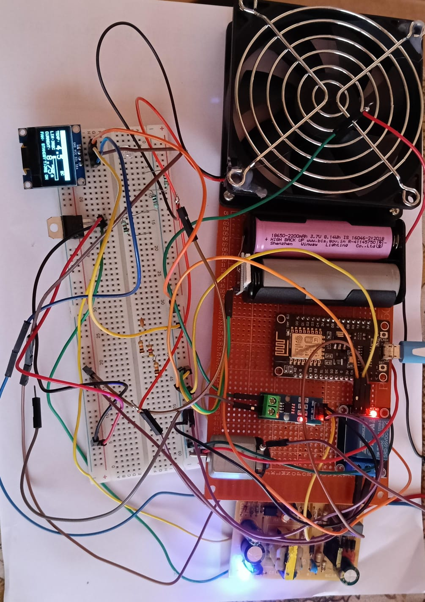

# SHODEN 🌡️💨


**SHODEN** is an intelligent, automated fan control system built on the NodeMCU ESP8266 platform. It continuously monitors ambient temperature and current consumption, drives a relay-controlled fan with hysteresis logic, and displays all live readings on a 0.96" OLED screen.

---


*Smart Fan Controller — NodeMCU ESP8266 with OLED, LM35, ACS712, and Relay Module*

---

## 🚀 Key Features

* **Automatic Fan Control:** Relay-driven fan activates above a configurable temperature threshold (default 30 °C) and deactivates with 2 °C hysteresis to prevent relay chatter.
* **Real-Time OLED Display:** 128×64 SSD1306 screen shows live temperature, current draw in amperes, a visual bar graph, and a dynamic fan status bar.
* **Current Monitoring:** ACS712 hall-effect sensor tracks real-time fan current, confirming operational load.
* **Dual Sensor Support:** Selectable firmware for LM35 linear sensor or NTC thermistor via compile-time flag.
* **Serial Telemetry:** Full sensor and relay state logging at 115200 baud for debugging and calibration.

---

## 🛠️ Hardware

| Component | Model / Spec | Pin / Connection | Purpose |
| :--- | :--- | :--- | :--- |
| **NodeMCU ESP8266** | v2 / v3 board | Central MCU | Processing & control |
| **OLED Display** | SSD1306, 0.96", I2C | SDA=D2, SCL=D1 | Live data display |
| **Temperature Sensor** | LM35 / NTC 10k | A0 (analog) | Ambient temp reading |
| **Current Sensor** | ACS712-05B / 20A | D8 via divider | Fan current monitor |
| **Relay Module** | 5V, Active LOW | D2 (GPIO4) | Fan ON/OFF switching |
| **Fan** | 5V or 12V DC | Via relay NO/COM | Room cooling load |
| **Power Supply** | 5V USB / adapter | VIN pin | System power |
| **Resistors** | 10kΩ + 20kΩ | ACS OUT divider | 3.3V level shifting |

---

## 🏗️ System Architecture

The firmware runs a continuous **sense → process → actuate** loop:

**Sensing Layer** — The LM35 outputs 10 mV/°C into the NodeMCU's A0 ADC (0–1 V range). The ACS712 output is voltage-divided to 3.3 V for safe reading on D8.

**Processing Layer** — Sensors are polled every 500 ms. A two-threshold hysteresis model controls the relay: fan turns ON above 30 °C and only turns OFF below 28 °C, protecting the relay from rapid cycling.

**Actuation & Display Layer** — GPIO4 drives the active-LOW relay. The OLED refreshes every second showing temperature with bar graph, current in amps, and an inverted status bar when the fan is running.

---

## 📌 Pin Mapping

| NodeMCU Pin | GPIO | Connected To | Signal Type |
| :--- | :--- | :--- | :--- |
| D1 | GPIO5 | OLED SCL | I2C Clock |
| D2 | GPIO4 | OLED SDA / Relay IN | I2C Data / Digital OUT |
| D8 | GPIO15 | ACS712 OUT (via divider) | Analog / Digital IN |
| A0 | ADC0 | LM35 / NTC Output | Analog IN (0–1V) |
| 3.3V | — | OLED VCC, Sensor VCC | Power |
| VIN | — | Relay VCC, ACS712 VCC (5V) | Power |
| GND | — | All GND connections | Common Ground |

---

## 💻 Getting Started

### Prerequisites

* Arduino IDE (v1.8.19+) or PlatformIO
* ESP8266 board package installed in Arduino IDE
* CH340 USB driver (for NodeMCU boards)

### Required Libraries

Install via Arduino Library Manager:

* `Adafruit SSD1306`
* `Adafruit GFX Library`
* `Wire` (built-in)

### Installation

**1. Add the ESP8266 board package:**

Go to **File → Preferences** and add this URL to the Board Manager URLs field:
```
http://arduino.esp8266.com/stable/package_esp8266com_index.json
```

**2. Install the board:**

Go to **Tools → Board Manager**, search for `ESP8266`, and install.

**3. Configure firmware:**

Open `fan_controller.ino` and set your sensor type and thresholds:

```cpp
#define SENSOR_LM35             // or #define SENSOR_NTC
#define TEMP_THRESHOLD  30.0    // °C — Fan turns ON
#define TEMP_HYSTERESIS  2.0    // °C — Fan turns OFF below (threshold - hysteresis)
#define ACS_SENSITIVITY  0.185  // V/A — 0.185 for 05B, 0.100 for 20A, 0.066 for 30A
#define ACS_ZERO_OFFSET  512    // Calibrate: ADC value at 0 A
```

**4. Flash the firmware:**

Select **Tools → Board → Generic ESP8266 Module**, set Upload Speed to `115200`, choose your COM port, and click **Upload**.

**5. Monitor output:**

Open Serial Monitor at `115200` baud. Expected output:
```
[BOOT] ESP8266 Fan Controller Starting...
[INFO] System ready.
[INFO] Fan threshold: 30.0°C | Hysteresis: 2.0°C
[DATA] Temp: 27.45°C | Current: 0.012 A | Fan: OFF
[DATA] Temp: 30.83°C | Current: 0.312 A | Fan: ON
[RELAY] Fan ON  → Temp 30.83°C >= threshold 30.0°C
```

---

## ⚙️ Software Design

### Libraries Used

* `Wire.h` — built-in I2C communication
* `Adafruit_SSD1306` — OLED driver for SSD1306 controller
* `Adafruit_GFX` — graphics primitives for text and shapes

### Fan Control Logic

The core control implements a two-threshold hysteresis model to prevent relay chattering when temperature hovers near the set point:

```
Fan turns ON  → temperature ≥ TEMP_THRESHOLD
Fan turns OFF → temperature < (TEMP_THRESHOLD − TEMP_HYSTERESIS)
```

### OLED Display Layout

The 128×64 display is divided into functional zones:

```
┌──────────────────────────────┐
│     FAN CONTROLLER v1.0      │  ← Inverted header bar
├──────────────────────────────┤
│ TEMP:  27.4°C   LIM: 30°C   │  ← Temperature + limit
│                 [███░░░░░░]  │  ← Visual bar graph
│ CURRENT:  0.31 A             │  ← ACS712 reading
├──────────────────────────────┤
│ FAN: STANDBY    T>30° ON     │  ← Status (inverts when ON)
└──────────────────────────────┘
```

---

## 📋 Important Notes

1. **NodeMCU A0 accepts 0–1 V** (internal divider). Place a 100 kΩ:220 kΩ voltage divider before A0 if sensor output exceeds 1 V.
2. **ACS712 operates best at 5 V.** Use a 10 kΩ + 20 kΩ voltage divider on its output before connecting to D8.
3. **D8 (GPIO15) must be LOW at boot.** Connect a 10 kΩ pull-down resistor to GND.
4. **Relay is active LOW.** The code sets the pin LOW to activate the fan and HIGH to deactivate it.
5. **Single ADC limitation.** NodeMCU has only one ADC (A0). For simultaneous temperature + current ADC reads, use a CD4051 analog multiplexer with a digital select pin.

---

## 📈 Expected Results

* Fan activates automatically when temperature rises above 30 °C
* Fan deactivates when temperature drops back below 28 °C
* OLED displays accurate real-time temperature and current readings
* ACS712 current reading confirms whether the fan is running and drawing load
* System operates reliably on 5 V USB power
* Serial Monitor provides full traceability for testing and calibration

---

## 🔭 Applications

* Room temperature automation and smart home integration
* Server rack cooling with overtemperature protection
* Industrial cabinet ventilation control
* Greenhouse climate control
* Educational embedded systems project demonstrating sensor fusion

---

## 📄 References

* [ESP8266 NodeMCU Datasheet — Espressif Systems](https://www.espressif.com/en/products/socs/esp8266)
* [ACS712 Current Sensor Datasheet — Allegro MicroSystems](https://www.allegromicro.com/en/products/sense/current-sensor-ics/zero-to-fifty-amp-integrated-conductor-sensor-ics/acs712)
* [LM35 Precision Temperature Sensor Datasheet — Texas Instruments](https://www.ti.com/product/LM35)
* [SSD1306 OLED Controller Datasheet — Solomon Systech](https://cdn-shop.adafruit.com/datasheets/SSD1306.pdf)
* [Adafruit SSD1306 Library](https://github.com/adafruit/Adafruit_SSD1306)
* [Arduino ESP8266 Core Documentation](https://arduino-esp8266.readthedocs.io)

---

**Developed with ❤️ as an Embedded Systems Project**
